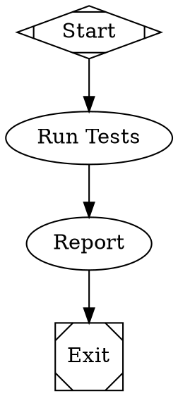
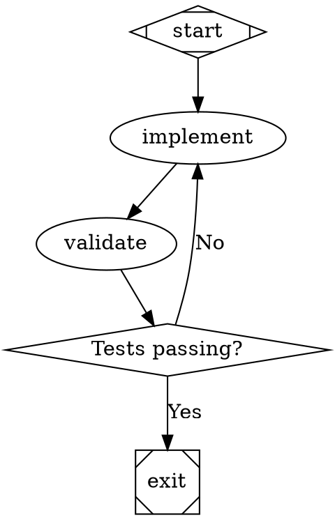

# Attractor - Node.js Implementation

A DOT-based pipeline runner for orchestrating multi-stage AI workflows, implemented in Node.js 24.

## Overview

Attractor lets you define AI workflows as directed graphs using Graphviz DOT syntax. The graph is the workflow: nodes are tasks, edges are transitions, and attributes configure behavior.

Based on the [Attractor Specification](https://github.com/strongdm/attractor/blob/main/attractor-spec.md).

## Features

- **Declarative Pipelines**: Define workflows in DOT format
- **Node Handlers**: Pluggable handlers for different task types (LLM calls, conditionals, parallel execution)
- **Checkpoint and Resume**: Automatic checkpointing after each node
- **Retry Logic**: Configurable retry policies with exponential backoff
- **Edge-based Routing**: Conditional routing based on outcomes and context
- **Goal Gates**: Critical stages that must succeed before pipeline completion

## Installation

```bash
npm install
```

## Usage

### CLI

Run a pipeline from a DOT file:

```bash
node src/cli.js examples/simple.dot
```

Specify a custom logs directory:

```bash
node src/cli.js examples/simple.dot ./my-logs
```

Resume from a checkpoint:

```bash
node src/cli.js examples/simple.dot ./my-logs --resume
```

### Programmatic API

```javascript
import { ExecutionEngine, parseDot } from 'attractor-nodejs';
import { readFile } from 'fs/promises';

// Read and parse DOT file
const dotSource = await readFile('workflow.dot', 'utf-8');
const graph = parseDot(dotSource);

// Create engine and run
const engine = new ExecutionEngine();
const result = await engine.run(graph, './logs');

console.log('Pipeline completed:', result.status);

// Resume from checkpoint
const resumedResult = await engine.resume(graph, './logs');
console.log('Pipeline resumed:', resumedResult.status);
```

## DOT Format

### Simple Linear Workflow



### Branching with Conditions



### Node Shapes

- `Mdiamond` - Start node (pipeline entry)
- `Msquare` - Exit node (pipeline exit)
- `box` - LLM task (default)
- `diamond` - Conditional routing
- `hexagon` - Human-in-the-loop gate
- `component` - Parallel fan-out
- `tripleoctagon` - Parallel fan-in

### Node Attributes

- `label` - Display name
- `prompt` - Instruction for LLM stages
- `max_retries` - Number of retry attempts
- `goal_gate` - Must succeed before pipeline exits
- `timeout` - Maximum execution time
- `shape` - Determines handler type

### Edge Attributes

- `label` - Human-readable caption
- `condition` - Boolean expression for routing
- `weight` - Priority for edge selection

## Testing

Run the test suite:

```bash
npm test
```

## Architecture

### Core Components

1. **DOT Parser** (`src/parser/`) - Parses Graphviz DOT syntax
2. **Execution Engine** (`src/engine/`) - Traverses graph and executes nodes
3. **Handlers** (`src/handlers/`) - Pluggable node executors
4. **Models** (`src/models/`) - Context, Checkpoint, Graph, Outcome

### Execution Flow

1. Parse DOT file into Graph model
2. Initialize Context and Checkpoint (or restore from checkpoint if resuming)
3. Traverse from start node (or resume from checkpoint node)
4. Execute each node via appropriate handler
5. Apply context updates
6. Select next edge based on outcome
7. Save checkpoint after each node
8. Repeat until exit node reached

## Examples

See the `examples/` directory for sample workflows:

- `simple.dot` - Linear workflow
- `branch.dot` - Conditional branching
- `retry.dot` - Retry configuration
- `tool.dot` - External command execution
- `human-gate.dot` - Human approval workflow
- `parallel.dot` - Parallel execution (fan-out/fan-in)

## Node.js 24 Requirement

This implementation requires Node.js 24 or later for:
- Native ESM support
- Built-in test runner
- Latest JavaScript features

## License

ISC

## Contributing

Contributions welcome! Please ensure:
- Tests pass: `npm test`
- Code follows existing style
- New features include tests
